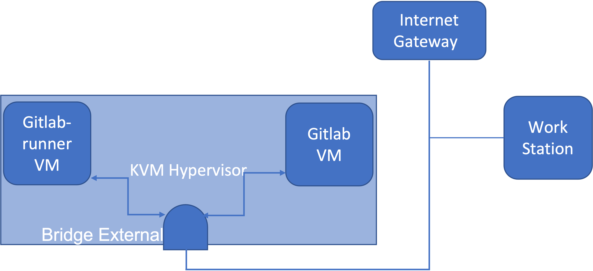
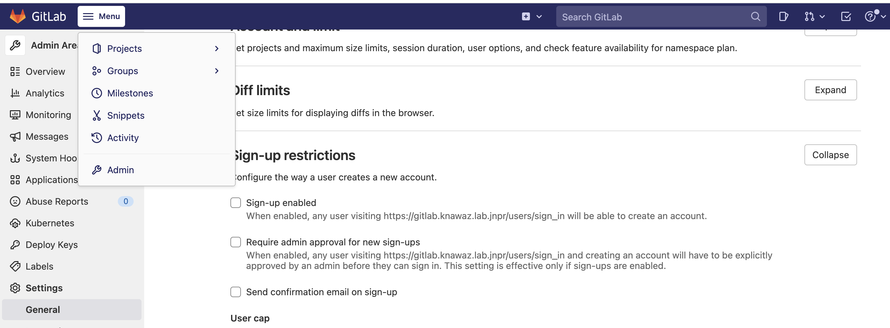
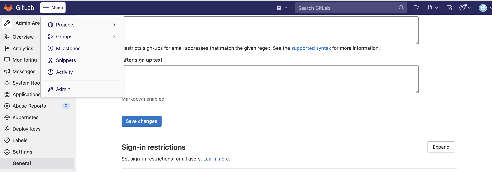
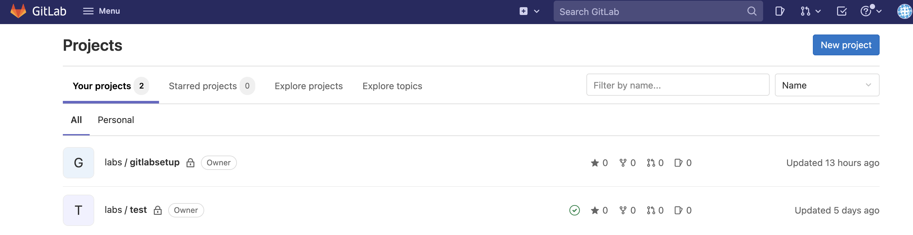
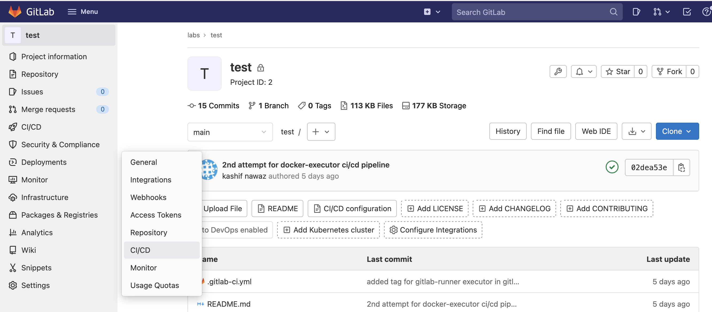
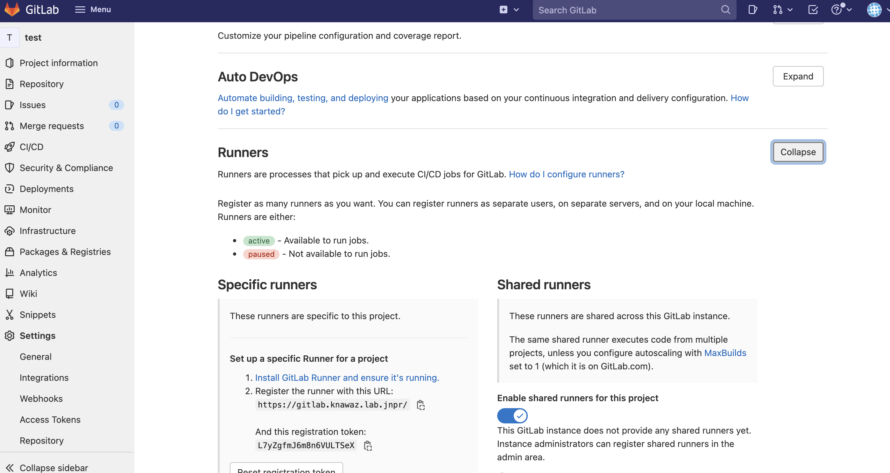

# Gitlab Local Instance Bring UP, it's Integration with gitlab-runner and setting up docker-executor
* This document is intended for readers who have working knowledge of git and some know how of gitlab CI/CD concepts.
* The aim of this document is to demonstrate , Gitlab Local Instance Bring UP, its integration with gitlab-runner and setting up docker-executor.
## Lab Diagram


 ## Gitlab VM Bring UP (executed from KVM Host)
 ```
node_name=gitlab
vcpus=4
vram=8096
node_suffix=knawaz.lab.jnpr
root_password=gitlab123
gitlab_password=gitlab123
export LIBGUESTFS_BACKEND=direct
cloud_image=/var/lib/libvirt/images/CentOS-7-x86_64-GenericCloud.qcow2
qemu-img create -f qcow2 /var/lib/libvirt/images/${node_name}.qcow2 100G
virt-resize --expand /dev/sda1 ${cloud_image} /var/lib/libvirt/images/${node_name}.qcow2

virt-customize  -a /var/lib/libvirt/images/${node_name}.qcow2   --run-command 'xfs_growfs /'   --root-password password:${root_password}   --hostname ${node_name}.${nodesuffix}   --run-command 'useradd gitlab'   --password gitlab:password:${gitlab_password}   --run-command 'echo "gitlab ALL=(root) NOPASSWD:ALL" | tee -a /etc/sudoers.d/gitlab'   --chmod 0440:/etc/sudoers.d/gitlab   --run-command 'sed -i "s/PasswordAuthentication no/PasswordAuthentication yes/g" /etc/ssh/sshd_config'   --run-command 'systemctl enable sshd'   --run-command 'yum remove -y cloud-init'   --selinux-relabel
```
##  Environment Specific Files

```
[gitlab@gitlab ~]$ cat /etc/sysconfig/network-scripts/ifcfg-eth0
DEVICE="eth0"
BOOTPROTO="static"
ONBOOT="yes"
TYPE="Ethernet"
USERCTL="yes"
PEERDNS="yes"
IPV6INIT="no"
IPADDR=192.168.3.20
NETMASK=255.255.255.0
GATEWAY=192.168.3.1

[gitlab@gitlab ~]$ cat /etc/hosts
127.0.0.1   localhost localhost.localdomain localhost4 localhost4.localdomain4
::1         localhost localhost.localdomain localhost6 localhost6.localdomain6

192.168.3.20 gitlab.knawaz.lab.jnpr gitlab
192.168.3.21 gitlab-runner.knawaz.lab.jnpr gitlab-runner

[gitlab@gitlab ~]$ cat /etc/resolv.conf
# Generated by NetworkManager
nameserver 1.1.1.1
```

## Installing Required Packages in Gitlab VM

```
yum -y install curl policycoreutils openssh-server openssh-clients postfix vim firewalld lynx mutt
systemctl start postfix && systemctl enable postfix && systemctl start firewalld && systemctl enable firewalld
curl -sS https://packages.gitlab.com/install/repositories/gitlab/gitlab-ce/script.rpm.sh | bash 
yum -y install gitlab-ce
```
# Adding Firewall Rules 

```
firewall-cmd --permanent --add-service http && firewall-cmd --permanent --add-service https
firewall-cmd --reload && firewall-cmd --list-all
```

## Setting UP TLS
### CA Root Cert Creation
```
openssl genrsa -out ca.key 2048
openssl req -new -sha256 -key ca.key -subj "/CN=GITLAB-KNAWAZ-CA" -out ca.csr
openssl req -x509 -sha256 -days 365 -key ca.key -in ca.csr -out ca.pem
```

### Server Cert Creation (wihout SAN)
```
openssl genrsa -out gitlab.knawaz.lab.jnpr.key 2048
openssl req -new -sha256 -key gitlab.knawaz.lab.jnpr.key -subj "/CN=gitlab.knawaz.lab.jnpr" -out gitlab.knawaz.lab.jnpr.csr
openssl x509 -req -in gitlab.knawaz.lab.jnpr.csr -CAcreateserial -CAserial ca.seq -sha256 -days 365 -CA ca.pem -CAkey ca.key -out gitlab.knawaz.lab.jnpr.pem
```
### Server Cert Creation (with SAN)
* If you need to add SAN in your Server Cert then upgrade opessl to  v[1.1.1](https://gist.github.com/fernandoaleman/5459173e24d59b45ae2cfc618e20fe06)

```
openssl req -newkey rsa:2048 -nodes -keyout gitlab.knawaz.lab.jnpr.key -subj "/CN=gitlab.knawaz.lab.jnpr" -out gitlab.knawaz.lab.jnpr.csr
openssl x509 -req -extfile <(printf "subjectAltName=DNS:knawaz.lab.jnpr,DNS:gitlab.knawaz.lab.jnpr") -days 365 -in gitlab.knawaz.lab.jnpr.csr -CA ca.pem -CAkey ca.key -CAcreateserial -out gitlab.knawaz.lab.jnpr.pem 
```

## Creating Chain Certificate 
```
cat gitlab.knawaz.lab.jnpr.pem ca.pem > /etc/gitlab/ssl/gitlab.knawaz.lab.jnpr.pem
cp gitlab.knawaz.lab.jnpr.key /etc/gitlab/ssl/
cp ca.key  ca.pem /etc/gitlab/ssl/
chmod 600 /etc/gitlab/ssl/*
```

## Updating Config File
* Update / edit following lines in /etc/gitlab/gitlab.rb as per your setup 
```
vim /etc/gitlab/gitlab.rb
external_url 'https://gitlab.knawaz.lab.jnpr'
nginx['redirect_http_to_https'] = true
nginx['ssl_certificate'] = "/etc/gitlab/ssl/gitlab.knawaz.lab.jnpr.pem"
nginx['ssl_certificate_key'] = "/etc/gitlab/ssl/gitlab.knawaz.lab.jnpr.key"
```

## Re-Configure Gitlab
* Be patient, as this step will take some time
```
gitlab-ctl reconfigure
```

## Access Gitlab GUI

* Get root user password 
```
cat /etc/gitlab/initial_root_password

```
* Access the Gitlab GUI via your favourite browser, but don't forget to add the self-signed certificate as trusted in your browser. 
* Login via root user.
```
https://gitlab-URL-AS-PER-YOUR-DNS-ENTRY 
```
## Disabling the Singup Option 

* Disabling the signup option is an important step. 




## Creating Users, Groups and Projects

* For the sake of brevity, I am avoiding adding screenshots from my setup.
* Visit the following link to view the relationship between groups, users, and projects.

```
https://docs.gitlab.com/ee/user/group/
```
## Gitlab-runner VM Bring Up (executed from KVM host)

```
node_name=gitlab-runner 
vcpus=8
vram=16192
node_suffix=knawaz.lab
root_password=gitlab123
gitlab_password=gitlab123
export LIBGUESTFS_BACKEND=direct
cloud_image=/var/lib/libvirt/images/CentOS-7-x86_64-GenericCloud.qcow2
qemu-img create -f qcow2 /var/lib/libvirt/images/${node_name}.qcow2 150G
virt-resize --expand /dev/sda1 ${cloud_image} /var/lib/libvirt/images/${node_name}.qcow2
virt-customize  -a /var/lib/libvirt/images/${node_name}.qcow2   --run-command 'xfs_growfs /'   --root-password password:${root_password}   --hostname ${node_name}.${nodesuffix}   --run-command 'useradd gitlab'   --password gitlab:password:${gitlab_password}   --run-command 'echo "gitlab ALL=(root) NOPASSWD:ALL" | tee -a /etc/sudoers.d/gitlab'   --chmod 0440:/etc/sudoers.d/gitlab   --run-command 'sed -i "s/PasswordAuthentication no/PasswordAuthentication yes/g" /etc/ssh/sshd_config'   --run-command 'systemctl enable sshd'   --run-command 'yum remove -y cloud-init'   --selinux-relabel
brctl show
virt-install --name ${node_name}   --disk /var/lib/libvirt/images/${node_name}.qcow2   --vcpus=${vcpus}   --ram=${vram}   --network bridge=br-external   --virt-type kvm   --import   --os-variant centos7.0    --graphics vnc   --serial pty   --noautoconsole   --console pty,target_type=virtio
```

##  Environment Specific Files

```
[gitlab@gitlab-runner ~]$ cat /etc/sysconfig/network-scripts/ifcfg-eth0
DEVICE="eth0"
BOOTPROTO="static"
ONBOOT="yes"
TYPE="Ethernet"
USERCTL="yes"
PEERDNS="yes"
IPV6INIT="no"
IPADDR=192.168.3.21
NETMASK=255.255.255.0
GATEWAY=192.168.3.1

[gitlab@gitlab-runner ~]$ cat /etc/hosts
127.0.0.1   localhost localhost.localdomain localhost4 localhost4.localdomain4
::1         localhost localhost.localdomain localhost6 localhost6.localdomain6

192.168.3.20 gitlab.knawaz.lab.jnpr gitlab
192.168.3.21 gitlab-runner.knawaz.lab.jnpr gitlab-runner

[gitlab@gitlab-runner ~]$ cat /etc/resolv.conf
# Generated by NetworkManager
nameserver 1.1.1.1
```
## Installing Docker

```
curl -fsSL https://get.docker.com/ | sh
systemctl status docker
systemctl enable docker
sudo systemctl start docker
```
## Installing Gitlab-runner 
```
curl -L "https://packages.gitlab.com/install/repositories/runner/gitlab-runner/script.rpm.sh" | sudo bas
sudo yum install gitlab-runner -y

mkdir -p /etc/gitlab-runner/certs
```

## Getting TLS Chain Certificate from Gitlab Server

```
scp gitlab@192.168.3.20:/etc/gitlab/ssl/gitlab.knawaz.lab.jnpr.pem /etc/gitlab-runner/certs/
```

## Verfying Connection to Gitlab Server

```
echo | openssl s_client -CAfile /etc/gitlab-runner/certs/gitlab.knawaz.lab.jnpr.pem -connect gitlab.knawaz.lab.jnpr:443
```

## Registering Gitlab-runner with Gitlab
### Collect Necessary Details from gitlab Project 

* The assumption is that a group is created, a user is mapped to the group, and a project is created under the group.
* In my case, group name is labs and project name is test.
* Click on the Gitlab icon on the left to see a list of your projects.

* Go to the relevant project where you want to set up CI/CD and click on Setting > CI/CD.

* In the left window, click on the Expand button against Runners.

### Registration Execution
```
GITLAB_SERVER_URL="https://gitlab.knawaz.lab.jnpr/"
REGISTRATION_TOKEN="token-obtained-from-gitlab-project"
TAGS="docker,junos,cli,site,ansible,automation"
CERT="/etc/gitlab-runner/certs/gitlab.knawaz.lab.jnpr.pem"

gitlab-runner -l debug  register \
  --non-interactive \
  --tls-ca-file $CERT \
  --url $GITLAB_SERVER_URL \
  --registration-token $REGISTRATION_TOKEN \
  --tag-list v$TAGS \
  --description "docker_runner" \
  --executor "docker" \
  --docker-image ubuntu:latest
```

* Change the TAGS as per your will (tags are important so that CI/CD jobs can be linked to the registered runner).
* Change the docker-image as per your will

### Expected Output of Runner Registration Process
* Following output shows that gitlab-runner registration went successful
```
Runtime platform                                    arch=amd64 os=linux pid=11544 revision=98daeee0 version=14.7.0
Checking runtime mode                               GOOS=linux uid=0
Running in system-mode.

Trying to load /etc/gitlab-runner/certs/gitlab.knawaz.lab.jnpr.pem ...
Dialing: tcp gitlab.knawaz.lab.jnpr:443 ...
Registering runner... succeeded                     runner=U6HBzRUy
Runner registered successfully. Feel free to start it, but if it's running already the config should be automatically reloaded!
```
### Verfication via CLI
```
gitlab-runner list
Runtime platform                                    arch=amd64 os=linux pid=11656 revision=98daeee0 version=14.7.0
Listing configured runners                          ConfigFile=/etc/gitlab-runner/config.toml
docker_runner                                       Executor=docker Token=fPBBhTt27N3xRws7hQfP URL=https://gitlab.knawaz.lab.jnpr/
``

## Edit Gitlab-runner Config
* You may need to mount /etc/hosts to allow Docker containers to resolve gitlab urls if your /etc/resolve.conf is unable to do so.
* It is also necessary to mount the /etc/gitlab-runner/certs directory so that the docker container can access the full chain certificate, or else the pipeline will fail.

```
vim /etc/gitlab-runner/config.toml
[runners.docker]
    volumes = ["/cache", "/etc/gitlab-runner/certs/gitlab.knawaz.lab.jnpr.pem:/etc/gitlab-runner/certs/gitlab.knawaz.lab.jnpr.pem:ro"]
    volumes = ["/cache", "/etc/hosts:/etc/hosts:ro"]
```   
## Running the Simple Pipeline 

### Create .gitlab-ci.yml
```
---
image: "alpine:latest"
stages:
  - build
build:
  stage: build
  script:
    - echo "Hello world"
  tags:
    - ci
```
### Execution 
```
git add .gitlab-ci.yml
git commit -m'added gitlab-ci'
git push -u origin main
```

### Check Pipline Status
* On the Gitlab UI, select your project , CI/CD > Pipelines.
* If the pipeline status is "Passed" , say hurray, else someone else needs to look into your setup.


